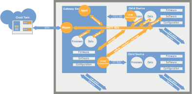

# A typical IIoT agent running thin-edge

A typical IIoT agent acts a gateway between the cloud and devices deployed over machines and plants.

- Each gateway control a piece of equipment, made up of devices with their hardware, software, sensors and actuators.
  From a cloud perspective, there are possibly tens of thousand of such pieces, each with its own gateway.
  However, here, the focus is on a single asset and the aim is to manage it from the cloud.
- The first requirement is to __manage__ from the cloud the __firmware__, __software packages__ and __configuration files__,
  which define the behavior of the embedded devices.
  As these are crucial for smooth running, one needs to control them at the scale of the fleet of assets,
  checking what is actually deployed and applying appropriate updates.
- The second requirement is to __collect__ __telemetry data__, __measurements__, __events__, __alarms__
  from sensors, devices and running processes and to make these data available on the cloud
  and __monitor__ at scale the industrial processes supported by the equipment.
- The last but not the least requirement is to be able to __trigger operations__ from the cloud
  on the devices for maintenance or troubleshooting.

All these capabilities are made available in the cloud using __device twins__,
virtual representations of the actual devices with remote control to:
- manage firmware, software packages and configuration files
- monitor the industrial processes,
- and operate the devices.

__The purpose of thin-edge is to support the development of such smart IIoT agents__,
by providing the building blocks to:
- provide a uniform way to monitor and control misc hardware and software despite the diversity of hardware and protocol,
- establish a cloud virtual view, a twin, of each piece of equipment that needs to be remotely monitored and managed,
- supervise on the embedded devices all the operations triggered from the cloud
  for firmware, software and configuration management,
- collect monitoring and telemetry data, forwarding these data to the cloud when appropriate.

TODO: describe the agent introducing thin-edge specific concept
- child devices
- services
- mapper
- plugins
- out-of-the box versus provided by the agent developer
- mosquitto
- tedge-mapper
- tedge-device-management
- child-device agent running on a child device
- child-device agent running on the main device on behalf of a non-MQTT child device
- services running on the devices and the child devices